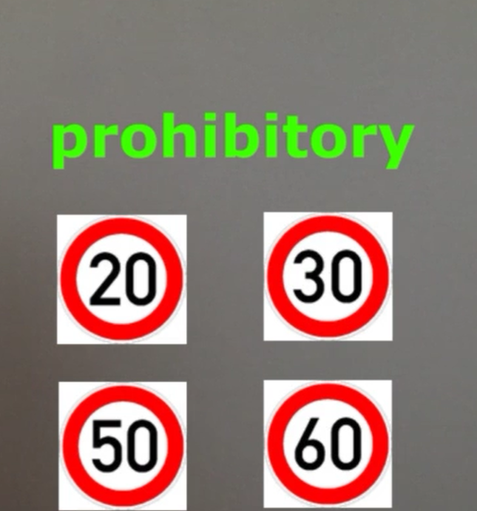
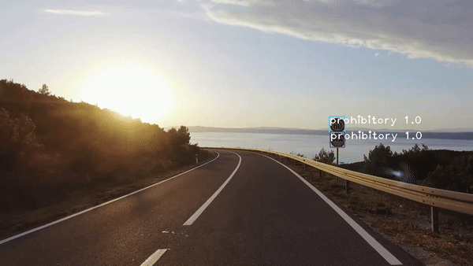

# YOLO_custom_traffic_sign_detection
Classifying Traffic signs into four classes using YOLO
1)Prohibitory
2)Danger
3)Mandatory
4)Other

You can download the annotated images(images.zip)from https://drive.google.com/file/d/1a03D6Nj7Dgl4kYpkkhjK9UlEvTwisGmr/view?usp=sharing 
and weights from https://drive.google.com/file/d/1-OqzVN8sdSzd1WEkRbIqIok0aiUuNy7o/view?usp=sharing

