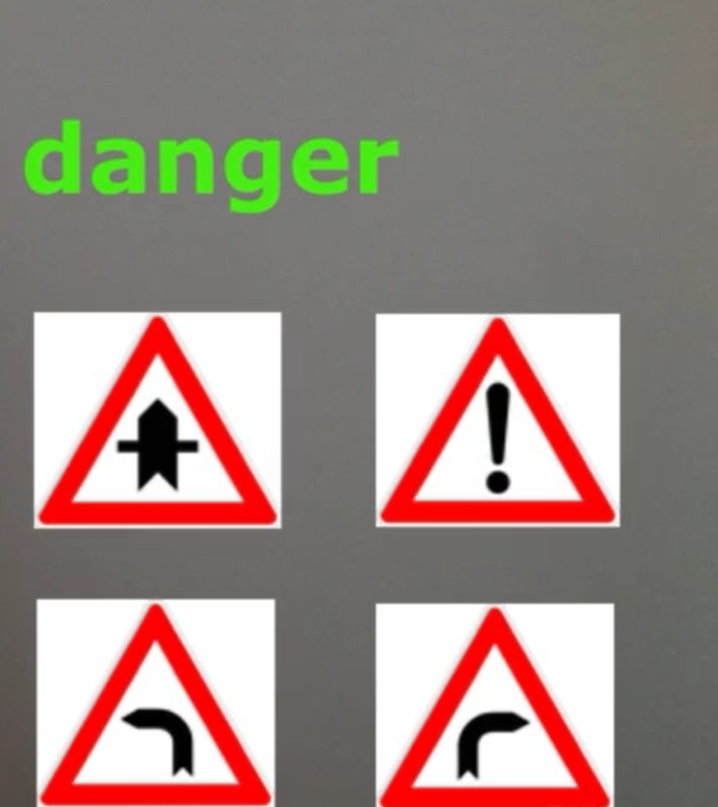
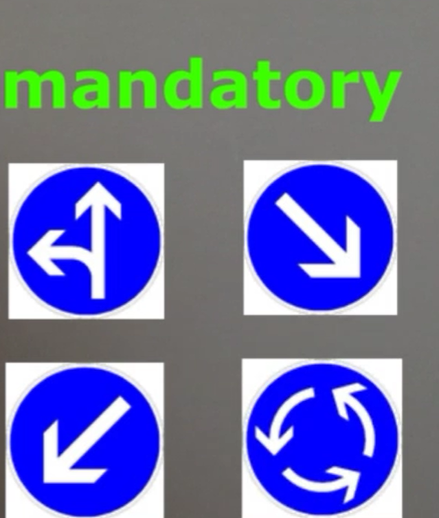
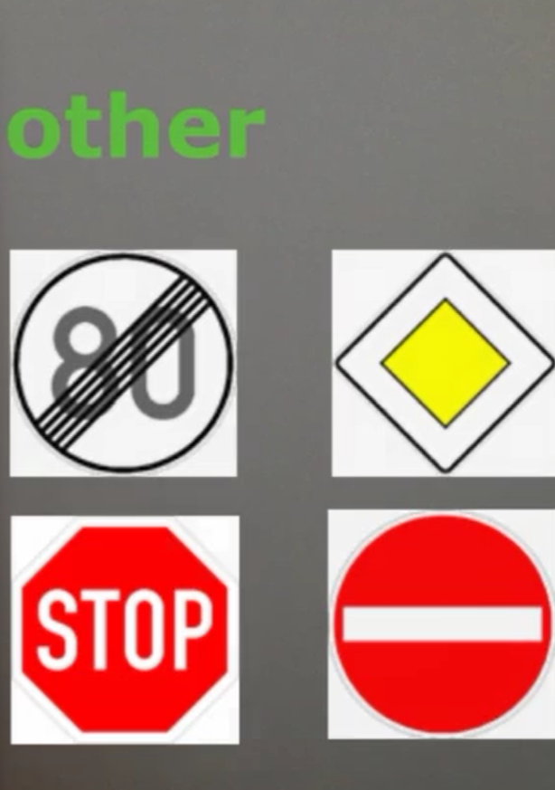

# YOLO_custom_traffic_sign_detection
Classifying Traffic signs into four classes using YOLO
1. Prohibitory
2. Danger
3. Mandatory
4. Other

You can download the annotated images(images.zip)from https://drive.google.com/file/d/1a03D6Nj7Dgl4kYpkkhjK9UlEvTwisGmr/view?usp=sharing 
and weights from https://drive.google.com/file/d/1-OqzVN8sdSzd1WEkRbIqIok0aiUuNy7o/view?usp=sharing

Few images that can be classified as prohibitory. They are circular and have red boundary. This is to make sure people do not prohibit this. For eg. speed limit traffic signs.

Few images that can be classified as danger. They are triangular and have red boundary. This is to alert people. For eg. danger ahead sign or deep curve ahead sign.

Few images that can be classified as mandatory. They are circular and are filled in blue. This is to tell people that these are mandatory. For eg.keep left sign and motorcycles only sign.

Few images that can be classified as other.

